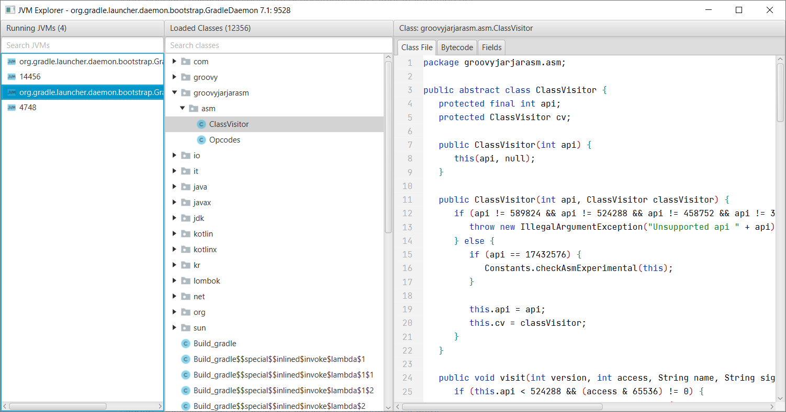

# JVM Explorer

JVM Explorer is a Java desktop application for browsing loaded class files inside locally running Java Virtual Machines.

## Features

* Browse local JVMs
* View all classes inside each JVM
* Search (supports regex) to find specific classes
* View decompiled bytecode
* View disassembled bytecode
* Export loaded classes to a JAR file
* Browse the state of all static variables in a class (and their nested fields)
* Modify the state of static variables (and their nested fields)
* Replace class file definitions
* View system properties of running JVMs
* Run JAR files with a patched `ProcessBuilder` to remove any `-XX:+DisableAttachMechanism` argument

## Getting Started

There are two ways to run the application. Execute a provided JAR file or build and run it yourself. This application is
intended to run on Java 11+ and can attach to JVMs running Java 7+.

### Run JAR:

1) Download the jvm-explorer JAR file from [the latest release](https://github.com/naton1/jvm-explorer/releases/latest)
2) Run with at least Java 11

### Build and run:

1) Clone with Git

`git clone https://github.com/Naton1/jvm-explorer.git`

2) Change into the project directory

`cd jvm-explorer`

3) Run with Gradle

`./gradlew run`

## Troubleshooting

Two logs files `application.log` and `agent.log` are created at `[User Home]/jvm-explorer/logs`

* Must run the JAR with a Java version of at least Java 11
* Must attach to a JVM running a Java version of at least Java 7
* Must attach to a JVM running the same architecture - a 32-bit JVM must attach to a 32-bit JVM
* The server port could be in-use for a few seconds after closing the application. Reopening the application immediately
  after could fail to complete the startup process (could improve this to find and use an open port).

## Possible Enhancements

* Plugins/scripting
* Multiple decompilers
* Inserting code (compile java code)
* Editing bytecode
* Execute code in attached JVM via JShell
* Tabs/open multiple classes
* Search code
* Detect changes between current classes and previous classes
* Internationalization
* Show class loader in class tree

## License

[MIT License](LICENSE.md)
