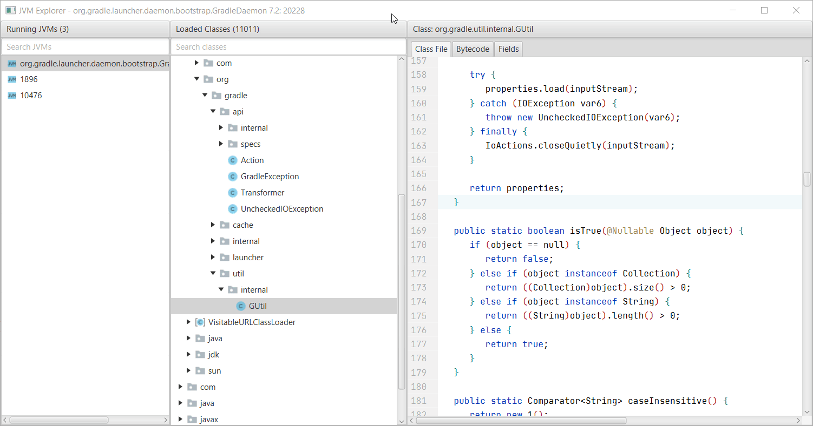

# JVM Explorer

JVM Explorer is a Java desktop application for browsing loaded class files inside locally running Java Virtual Machines.

## Features

* Browse local JVMs
* View all classes inside each JVM
* Search to find specific classes (supports regex)
* View classloader hierarchy
* View decompiled bytecode
* View disassembled bytecode
* Re-assemble bytecode
* Re-compile class file
* Modify method implementations (insert, replace method body with java code)
* Execute code in local JVMs
* Export loaded classes to a JAR file
* Browse the state of all static variables in a class (and their nested fields)
* Modify the state of static variables (and their nested fields)
* Replace class file definitions
* View system properties of running JVMs
* Run JAR files with a patched `ProcessBuilder` to remove any `-XX:+DisableAttachMechanism` argument

### Demos

  
Browse Classes And Fields

Notes:

* Ctrl + Click on a class name in the class file viewer to open it
* Search and press enter to open a class with the specified name
* Edit a field value (under Fields tab) through Right Click -> Edit - only works for primitives and Strings

  
Execute Code In Remote JVM

 

  
Show Class Loader Hierarchy

 

  
Launch Jar With Patched ProcessBuilder

 

  
Export Classes In Package

 

  
Modify Method

Notes:

* You can modify the method or replace the entire method body
* The compiler currently uses the loaded classes as the classpath, so if a parameter type or return type isn't loaded,
  it may fail

  
Modify Class

Notes:

* Ctrl+S to re-recompile and patch class (or Right-Click -> Save Changes)
* Often, decompiled code is not valid Java code, so it may not compile in some cases - the modify method feature is the
  workaround for this
* The compiler currently uses the loaded classes as the classpath, so if a parameter type or return type isn't loaded,
  it may fail

  
Modify Bytecode

Notes:

* Ctrl+S to re-assemble and patch class (or Right-Click -> Save Changes)
* The disassembler/assembler isn't perfect - it works most of the time but struggles with some cases (it uses OpenJDK
  AsmTools)

## Getting Started

There are three ways to run the application. Execute a provided platform-specific installer, a provided JAR file, or
build and run it yourself. This application is intended to run on Java 11+ and can attach to JVMs running Java 7+.

### Run Installer:

The platform-specific installers currently support Windows, Linux, and Mac with Intel 64-bit arch.

1) Download a platform-specific installer (look at file extension)
   from [the latest release](https://github.com/naton1/jvm-explorer/releases/latest)
2) Run the installer
3) Launch the installed program

### Run JAR:

The provided JAR currently supports Windows, Linux, and Mac with Intel 64-bit arch.

1) Download the jvm-explorer JAR file from [the latest release](https://github.com/naton1/jvm-explorer/releases/latest)
2) Run with at least Java 11

### Build And Run:

This approach will work on all platforms and architectures.

1) Clone with Git

`git clone https://github.com/Naton1/jvm-explorer.git`

2) Change into the project directory

`cd jvm-explorer`

3) Run with Gradle

`./gradlew run`

## Troubleshooting

Two logs files `application.log` and `agent.log` are created at `[User Home]/jvm-explorer/logs`

* Must run the JAR with a Java version of at least Java 11
* Must attach to a JVM running a Java version of at least Java 7
* Must attach to a JVM running the same architecture - a 32-bit JVM must attach to a 32-bit JVM
* May have to attach to a JVM that the same user started
* Must attach to a JVM that supports the Java Attach API
* If you run an old version of this application and attach it to a JVM, then update to a newer version and try to
  re-attach, the agent will be outdated. If there are changes in the client-server protocol, the agent will fail.
  Restart the target JVM to fix this.

Note: this uses the Java Attach API so any limitations will apply here.

## Project Principles

* Maintain a simple and easy-to-use interface
* Take advantage of attaching to running JVMs - this is not a traditional GUI decompiler

## Possible Enhancements

* Plugins/scripting
* Tabs/open multiple classes
* Search code/improved search mechanism
* Option to load all classes
* Internationalization
* Observe changes in fields

## License

[MIT License](LICENSE.md)